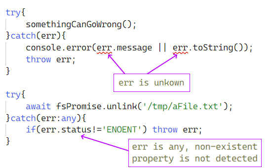

<!--multilang v0 es:LEEME.md en:README.md -->
# cast-error
<!--lang:es-->

uso de catch con errores fuertemente tipados

<!--lang:en--]

cast Error for use in TypeScript in catch clausule

[!--lang:*-->

<!-- cucardas -->

[](https://npmjs.org/package/cast-error)
[](https://npmjs.org/package/cast-error)
[](https://github.com/codenautas/cast-error/actions/workflows/node.js.yml)
[](https://coveralls.io/r/codenautas/cast-error)
[](https://github.com/codenautas/cast-error/pulls/app%2Fdependabot)

<!--multilang buttons-->

idioma: 
también disponible en:
[](README.md)

<!--lang:es-->

## Instalación

<!--lang:en--]

## Install

[!--lang:*-->

```sh
$ npm install cast-error
```

<!--lang:es-->

## Objetivo principal

Tener un mecanismo en _Typescript_ que reciba errores tipados. 

Por un lado en _Typescript_ la forma `catch(err)` implica que `err` 
es o bien de tipo `unknown` (comprtamiento actual) o bien de tipo `any`
(comportamiento anterior). Eso hace que o bien no se puede escribir
`err.code` o bien no detecta el error de tipeo al escribir `err.code_num`.

Por otro lado en _Javascript_ se puede hacer throw de una variable
cualquiera (aunque no sea un objeto de la clase Error), incluso se puede
hacer `throw null`. Entonces no es seguro escribir `err.message`. 

Con **cast-error** se solucionan ambos problemas de una manera cómoda,
elegante y eficiente:

En vez de escribir:

<!--lang:en--]

## Main goal

Have handy way to receive typed Errors y _Typescript_.

In one hand in _Typescript_ when you use `catch(err)` the variable
`err` is of type `unkown` (formerly `any`). Thats why you cannot 
write `err.code` for `SystemErrors` (formerly you can but `tsc`
did not warn you if you make a typo like `err.code_num`)

In the other hand in _Javascript_ you can throw any varialbe 
regardles of its type. You can even throw `null`. Then it is'n
safe to write `err.message`.

With **cast-error** this problems are solved in a fancy and eficient
way.

Instead of writing this:

[!--lang:*-->



<!--lang:es-->

con **cast-error** eso se puede escribir así: 

<!--lang:en--]

with **cast-error** you can write:

[!--lang:*-->


```ts
try{
    somethingCanGoWrong();
}catch(err){
    var error = castError.unexpected(err); // implicit console.err because is unexpected
    throw err;
}

try{
    await fsPromise.unlink('/tmp/aFile.txt');
}catch(err){
    var error = castError.expected(err)
    if(error.code!='ENOENT') throw err;  // code exists in error because is a SystemError
}
```

<!--lang:es-->

## Licencia

<!--lang:en--]

## License

[!--lang:*-->

[MIT](LICENSE)
